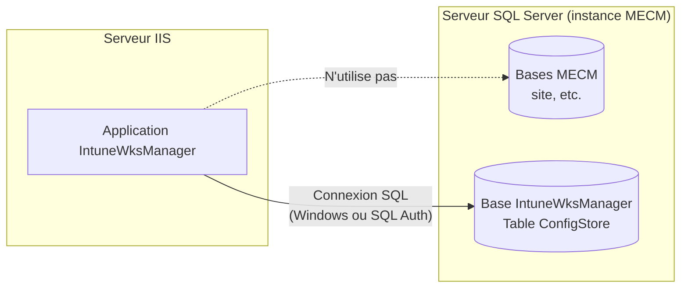
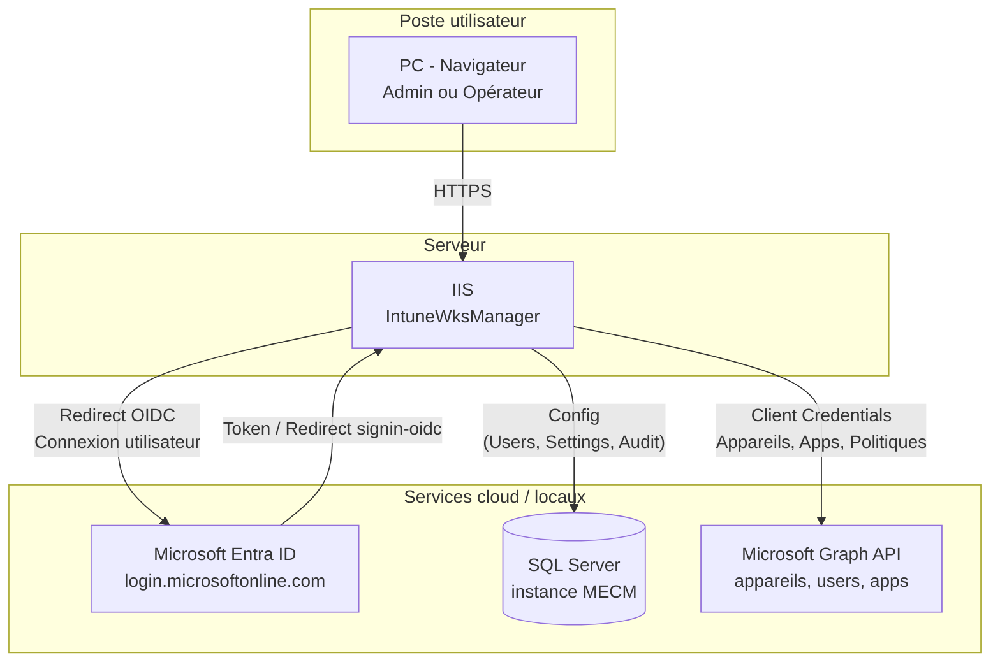
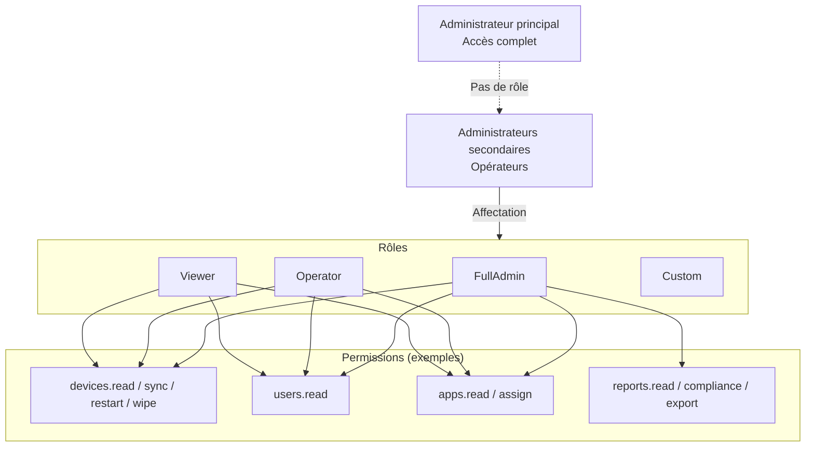
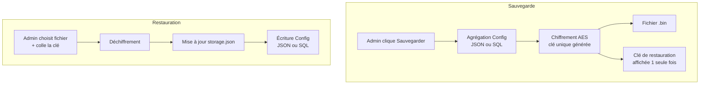
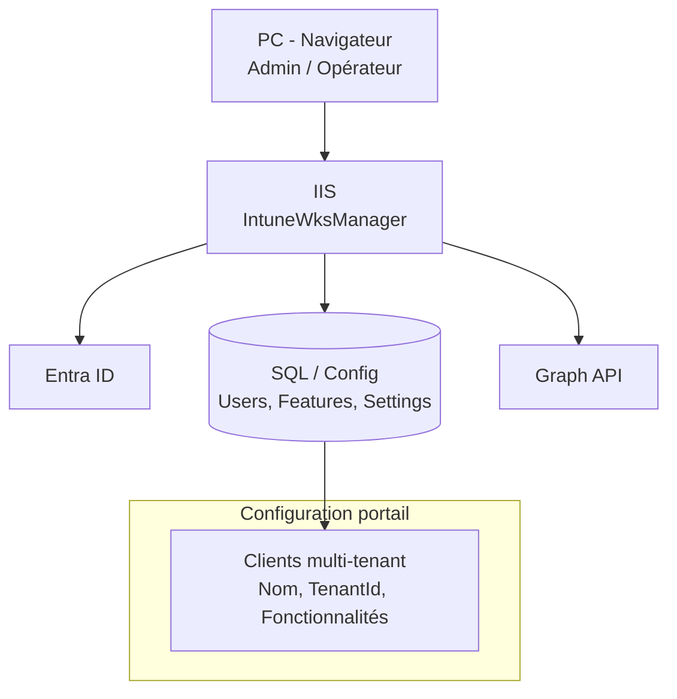

# Schémas Mermaid pour IntuneWksManager

Exporter chaque bloc Mermaid en PNG ou SVG (ex. [mermaid.live](https://mermaid.live)) puis insérer les images dans le document Word à la place des zones « Schéma » du fichier `DOC-IntuneWksManager-Word.html`.

---

## Schéma 1 — Instance SQL MECM et base IntuneWksManager

**Légende à ajouter sous le schéma :** La base IntuneWksManager est une base distincte sur la même instance SQL que MECM.

---

## Schéma 2 — Connexion Admin / Opérateurs (PC → IIS → Entra ID / SQL / Graph)

**Légende :** Les utilisateurs se connectent depuis leur PC via le navigateur ; l'application s'authentifie auprès d'Entra ID et lit/écrit la config en SQL (ou JSON) et appelle Graph pour Intune.

---

## Schéma 3 — Modèle RBAC

**Légende :** Les opérateurs ont un rôle ; le rôle définit la liste des permissions qui déterminent les onglets et actions visibles dans l'interface Opérateur.

---

## Schéma 4 — Flux Sauvegarde et Restauration

**Légende :** La clé de restauration n'est pas dans le fichier ; elle doit être conservée par l'admin pour toute restauration future.

---

## Schéma 5 — Clients multi-tenant et connexion

**Légende :** La liste des clients (entités organisation) et leurs fonctionnalités est stockée dans la config (JSON ou ConfigStore) et lue par l'application au démarrage / à la demande.
